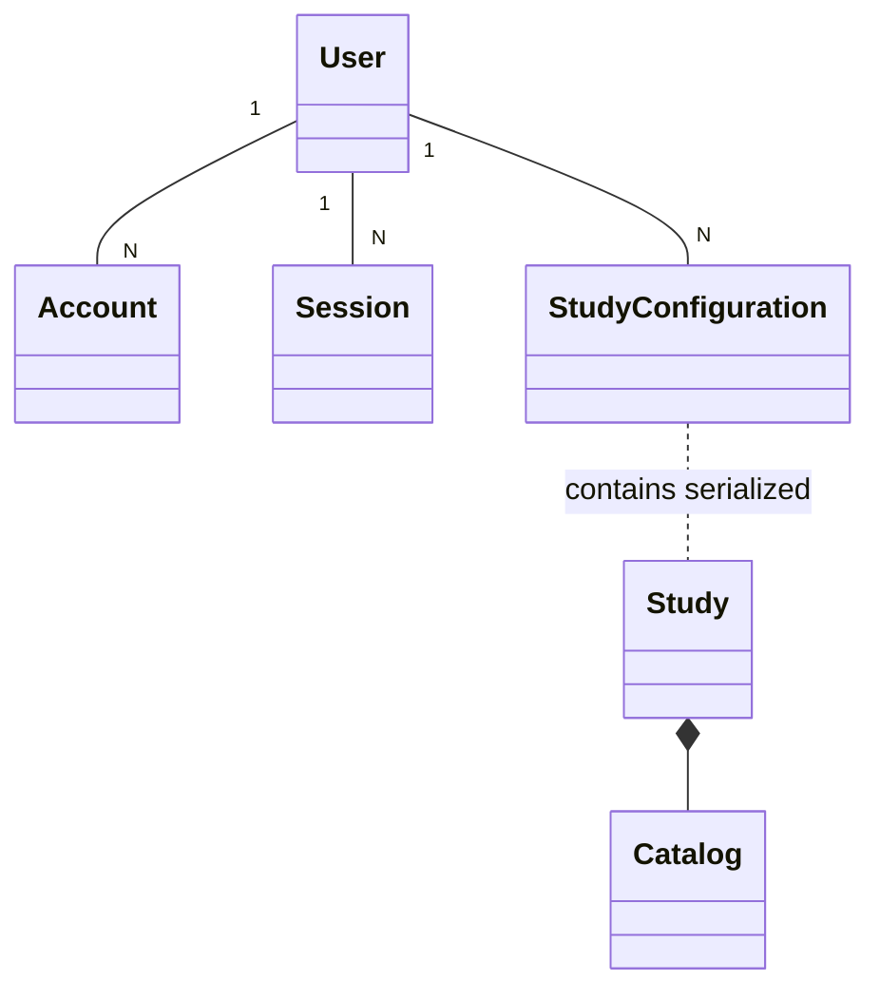

# Data Model

This document describes the core entities of the Study Configurator, migrated from the Java/Swing implementation.

## Core Entities

### Study
The root entity representing a specific degree program.
- **Fields**: `id`, `name`, `academicalGrad`, `minimalEtcs`, `standardAmountOfSemester`.
- **References**: Contains a `Catalog`.

### Catalog
A collection of all available modules for a study program, organized hierarchically.
- **Hierarchy**: `Catalog` -> `Chapter` -> `Domain` -> `Module`.

### Module
The central unit of study.
- **Types**: `MandatoryModule`, `ElectiveModule`, `OptionalModule`.
- **Fields**: `code`, `name`, `etcs`, `availability`, `recommendedSemester`.
- **Logic**: Can have multiple `Requirement`s.

### Requirement (Discriminated Union)
Represents a prerequisite for a module or course.
- **Types**:
    - `ModuleRequirement`: Depends on another module being selected.
    - `CourseRequirement`: Depends on a specific course completion.
    - `CertificateRequirement`: Depends on an external certificate.
    - `KnowledgeRequirement`: Depends on specific domain knowledge (Domain/Level).

## Helper Types
- **Salutation**: male, female, divers, neutral, undefined.
- **CertificationType**: unrated, ratedInterview, ratedExam.
- **KnowledgeLevel**: knowing, understanding, practicing, analysing, developing, judging.

### [NEW] User & Auth Entities
- **User**: Represents a student with a unique identity.
- **Account**: Links a user to an OAuth provider (e.g., Google).
- **Session**: Manages active user sessions.
- **StudyConfiguration**: Stores a serialized JSON snapshot of the student's current study plan.

## Entity Relationship Diagram (Mental Model)

